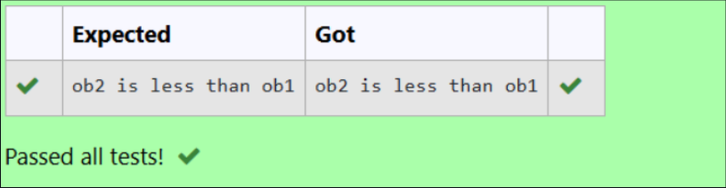

# 🐍 Python OOP: Operator Overloading (Less Than `<`)

## 🎯 AIM

To write a Python program that demonstrates **operator overloading** by overloading the **less than (`<`)** operator using a custom class.

---

## 🧠 ALGORITHM

1. **Create Class `A`**:
   - Define the `__init__()` method to initialize the object with a value `a`.

2. **Overload the `<` Operator**:
   - Define the `__lt__()` method with logic:
     - If `self.a < o.a`, return `"ob1 is less than ob2"`
     - Else, return `"ob2 is less than ob1"`

3. **Create Objects**:
   - Instantiate two objects `ob1` and `ob2` with values.

4. **Use `<` Operator**:
   - Use `print(ob1 < ob2)` to trigger the overloaded behavior.

---

## 💻 Program
```
class  A:
    def __init__(self,value):
        self.value=value
    def __gt__(self,other):
        return self.value >other.value

ob1=A(200)
ob2=A(30)

if ob2<ob1:
    print("ob2 is less than ob1")
else:
    print("ob1 is less than or equal to ob2")
```
## Output

## Result
Thus the python program was executed successfully.